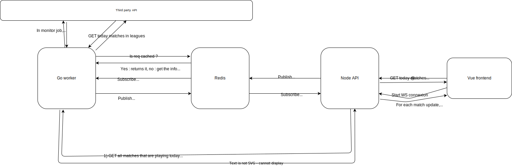

# Footies

Hello, welcome on footies repo ✨

Footies is a live betting football application, allowing users to bet on live matches and get up to date informations.

## Structure

Footies has 3 main services :

-   A front-end written in Vue
-   An API written in Node
-   A worker written in Golang

### Front-end

TODO

### API

The Restful API is the bridge between the front-end and the worker. It communicates with the front-end with websockets, and with workers using redis pub/sub or REST API.

### Worker

The Worker communicates with a third party API to get live informations about currently playing football games.
It exposes informations about matches and leagues with a GET endpoint, and also listen for some messages to trigger job in a redis pub/sub channel.

#### Job specs

For now, the go worker only job is to monitor live game. It will subscribe for event in a redis channel called "monitoring", and the payload with by a slice of ids that correspond to the match to monitor.
Before starting monitoring, the worker will ask redis if the match is already being monitored. If not, it start the monitoring and add the id of the match in redis. If yes, it simply do nothing and let go the publication.
For monitoring, it will ask every 15 seconds a third party API for informations about the match. Whenever something changed, it will publish an event in a redis channel named by "matchupdate\_[matchID]" with updated informations.

### Architecture

## Specs

### Versions

-   Node 20.10.0
-   Vue 3.3.8
-   Go 1.20.5
